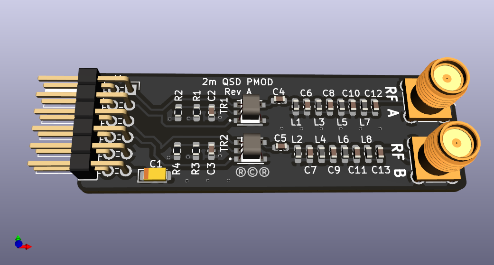

# 2m QSD PMOD

The board is designed for experimenting with an all-digital SERDES-based
quadrature sampling detector (QSD) and quadrature modulator.

This is a PMOD for differential (balanced) to/from single-ended (unbalanced)
I/O.  It has a 4:1 balun to match the 200 Ohm impedance of the PMOD to the
50 Ohm SMA.

The center tap on the balun is biased at VDD/2.

The board includes a 4-pole band-pass filter centered around the 2m amateur
radio band.  It is a Chebyshev filter with 1dB ripple in the passband. It is
designed to both be an anti-aliasing filter and to suppress the commercial
FM radio band.

This repo contains KiCAD files and Gerbers for those wanting to make their
own boards.

An [interactive BOM](bom/ibom-2m%20QSD%20PMOD-A.html) is available.

This project is OSHW (Open Source Hardware), released under the GPLv3 license.

